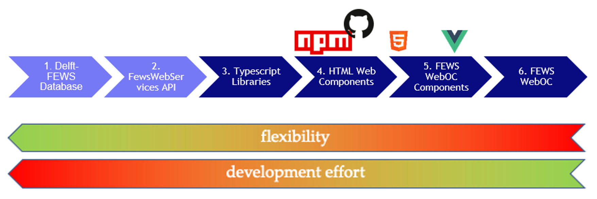

# Technical Architecture

The Delft-FEWS Web Operator Client (Web OC) will interact with the Delft-FEWS database by means of the FewsWebServices API. However, by using the FewsWebservices API, organizations are not limited to front-end applications developed by Deltares. There are various levels to interact with our software components (fig.1):

- Develop your own web applications on top of FewsWebServices, without using any further front-end components developed by Deltares.
- Make use of Typescript libraries (to interpret FewsWebServices API calls) developed by Deltares in your own web applications connected to Delft-FEWS.
- Re-use Web OC front-end components (HTML5) as well as Typescript libraries in your own web applications connected to FEWS. Or use components as a reference for your own implementation in a JavaScript framework.
- Use the entire Web OC stack including back-end and front-end components as developed by Deltares

Diagram below shows the software architecture of the Web OC in relation to Delft-FEWS. 

## Technical framework

The following software frameworks are used to develop Web OC

|              | Delft-FEWS Web OC         |
| ------------ | ------------------------- |
| Language     | Typescript and Javascript |
| Framework    | Vue.js (Vue 3)            |
| UI Framework | Vuetify3 + Vite           |
| Maps         | Mapbox                    |
| Charts       | d3js + custom, eCharts    |

*Please note that we are currently in the proces of migrating Web OC from the Vue 2 to Vue 3 framework*.

## Licensing and Software distribution
 
Components 1 (Delft-FEWS database) and 2 (FewsWebServices API) in the diagram above are already part of the Delft-FEWS software suite. The license under which these components are made available and the manner in which they are provided will not change with introduction of the Web OC. Additionally, Deltares intends to offer new components 3 to 6 as in addition to the current Delft-FEWS software:

#### Web OC Typescript libraries:
1.	fews-pi-requests
2.	fews-ssd-requests
3.	fews-wms-requests

#### Web OC HTML 5 components (currently available)
1.	Schematic status display component

#### Web OC Vue components (currently available)
1.	Topology component
2.	SSD component
3.	Spatial display component
4.	System monitor component

#### Web OC Application
1.	Web OC application

The idea behind the above architecture is that different consumers (existing or new FEWS end-users/intermediaries/consultants) of the Web OC software can connect at their relevant level of the architecture. A few examples:

1.	A customer of Deltares needs a web interface for their Delft-FEWS environment. The customer acquires the complete Web OC application from Deltares. Any software development is carried out by Deltares.
2.	Similar to (1), except the customer (or a customer consultant) wants to make modifications to the Web OC code for their own use. The customer acquires the complete Web OC application from Deltares and makes modifications to the underlying Vue components, HTML components, and libraries.
3.	A consumer intends to present information from FEWS in a web environment not developed or to be developed by Deltares (i.e., not a Web OC application). When consumers want to present the data in a similar way to one of the Web OC components, they can use Web OC HTML 5 components. These components are JavaScript-platform independent and can thus be reused in platforms other than Vue.js.
4.	Similar to (3), except consumers want to present data in their own unique way and do not want to use Web OC HTML 5 components. A consumer can then utilize the Web OC TypeScript libraries and develop their own web components based on them.

Based on the described usage above, the Web OC TypeScript libraries and HTML5 components are available under the Permissive MIT license. This allows the use of Web OC libraries and components in packages developed by third parties with a different licensing model. 
Components 5 (Vue components) and 6 (Web OC application) are made available under the "Copyleft/protective" GNU AGPL license. With this license, it is prohibited for consumers to include the Vue components and/or the Web OC application as-is in their own software without also making the source code of such software available under the AGPL license, thus preventing it from becoming proprietary software.

### Software distributions:
- Web OC Application and components: https://github.com/Deltares/fews-web-oc
- PI REST libraries: https://github.com/Deltares/fews-pi-requests                   
- SSD libraries : https://github.com/Deltares/fews-ssd-requests
- WMS libraries : https://github.com/Deltares/fews-wms-requests

In the case of Deltares customer-specific orders for one or more of the software components 1 to 6 (Figure 1: Delft-FEWS Web OC Architecture), the existing FEWS executable License Agreement will be used. In the specific customer contract, a product will be delivered based on specific requirements, and within this customer contract, we will extract the product (IP, liability, warranties) from the customer contract terms and apply the FEWS License Agreement terms, including the customer's indemnification for the use of the FEWS component(s).

## Release management
Information to be added.

## Support
The Delft-FEWS Web OC will become an integral part of the overall Delft-FEWS product (see section Development goals) for which Deltares provides dedicated S&M packages: https://oss.deltares.nl/web/delft-fews/services . 
