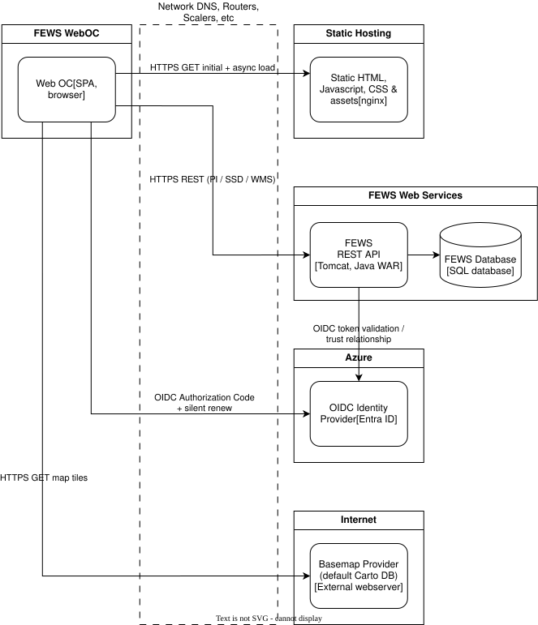

# Delft-FEWS Web OC Deployments

The Delft-FEWS Web OC is a single page web application. The build consists of static HTML, JavaScript, CSS and other assets. These files need to be made available on a static hosting service like [Nginx](https://nginx.org/), [Apache HTTP Server](https://httpd.apache.org/), [IIS](https://www.iis.net/), [Tomcat](https://tomcat.apache.org/), Azure [Static Web Apps](https://azure.microsoft.com/en-us/products/app-service/static) and [AWS Amplify](https://aws.amazon.com/amplify/hosting/). How to configure the static hosting and a list of advised Content Security Policies are provided in this document.

Next to the static hosting service, the web services requires the [Delft-FEWS Web Services](https://publicwiki.deltares.nl/x/84vFBw) to communicate with the Delft FEWS system. The FEWS Web Services are used to obtain configuration, spatio temporal data (PI & WMS), reports, schematic status displays (SSD) and system status. It can also be used to edit time series & reports and run workflows, tasks & what if scenarios. For the last functionality it is essential that authentication and authorization are in place. The Web OC and FEWS Web Services support the [OpenID Connect](https://openid.net/) standard, and are known to work with [Azure Entra ID](https://www.microsoft.com/en-us/security/business/identity-access/microsoft-entra-id), [AWS Identity and Access Management](https://docs.aws.amazon.com/IAM/latest/UserGuide/introduction.html) and [Keycloak](https://www.keycloak.org/). Standard basemaps providers (external) like [CARTO](https://carto.com/basemaps/), [Mapbox](https://www.mapbox.com/) and [MapTiler](https://www.maptiler.com/maps/base/). An active subscription and MAP API key is required to load base maps.

## Public hosting

>[!NOTE]
> We are investigating the impact on the FEWS Web Services and FEWS system for a publicly available Web OC

Making the Web OC publicly available does not by itself require the FEWS Web Services to be public. The browser must be able to reach the configured FEWS Web Services URL, either directly or through a reverse proxy. If the FEWS Web Services are exposed outside the trusted network, assess the following impacts before deployment:

- Require HTTPS and OpenID Connect authentication for protected environments. Do not use `VITE_REQUEST_HEADER_AUTHORIZATION: Off` for sensitive data or operations unless the Web Services are protected by an equivalent control.
- Review `WebServices.xml` and FEWS permissions with least privilege. Pay particular attention to endpoints that edit time series or reports, run workflows and tasks, or execute what-if scenarios; these require both authentication and authorization.
- Prefer a same-origin reverse proxy where possible. Otherwise configure CORS for the exact Web OC origin and verify that no unintended origins, methods, headers, or credentials are allowed.
- Protect the FEWS Web Services with a firewall or gateway, rate limiting, request-size limits, monitoring, and audit logging. Do not expose the FEWS database or other internal services directly to the internet.
- Assess the expected increase in concurrent requests and load-test the read and write operations. Public static assets can be cached, but FEWS Web Services responses should only be cached when their data and authorization semantics allow it.

## Example container overview of Web OC infrastructure with OIDC provider

The schematic gives an often used infrastructure for Web OC hosting. All Web OC build assests are served by a self hosted Nginx web server. The FEWS WebServices are running in Tomcat and have a conncetion to the FEWS database. Azure Entra ID is used ase OIDC identy provider. Basemaps layers are provided by CARTO.



## Static hosting setup

When deployed to a server like Nginx or Tomcat it is required to make sure that all requests are mapped to the `index.html` page of the web oc. This means that the server will have to redirect all HTTP 404 errors to the `index.html`. How this can be done is explained per deployment option.

### Tomcat

The Delft-FEWS Web OC can be deployed in Tomcat. The Web OC can be provided as different distributions: root or weboc.

The following assumes a root distribution, but where "ROOT" is used in the following it can also be replaced with "weboc" when a weboc distribution is used.

In the webapps folder of tomcat, create a directory named: "ROOT".
Unzip the Delft-FEWS Web OC distribution into that folder.
Create a subfolder "WEB-INF" in the ROOT folder.
Create the file "[web.xml](tomcat/ROOT/WEB-INF/web.xml)" in the WEB-INF folder.

```xml
<?xml version="1.0" encoding="UTF-8"?>
<web-app xmlns="http://java.sun.com/xml/ns/javaee"
xmlns:xsi="http://www.w3.org/2001/XMLSchema-instance"
xsi:schemaLocation="http://java.sun.com/xml/ns/javaee
http://java.sun.com/xml/ns/javaee/web-app_3_0.xsd"
version="3.0">
<description>Delft-FEWS Web OC</description>
<!-- For the web oc all 404 errors need to redirect to the index.html page. -->
<error-page>
<error-code>404</error-code>
<location>/index.html</location>
</error-page>
</web-app>
```

Customize the app-config.json file.

After starting tomcat, the Delft-FEWS Web OC is available at: http://localhost:8080

### Azure Static Web App using Azure DevOps

Using Azure DevOps a pipeline can be created to build and deploy the Delft-FEWS Web OC.
The following is an example of a pipeline: [azure-pipelines.yml](azure/azure-pipelines.yml).
To make sure all requests are redirected to the index.html, the following [staticwebapp.config.json](azure/staticwebapp.config.json) has to be added to the deployment.

### Delft-FEWS Standalone

The Delft-FEWS Web OC can be deployed in a Delft-FEWS Standalone as follows.

In the "Modules" folder of the Delft-FEWS Region Home folder, create a directory named: "weboc".
Unzip the Delft-FEWS Web OC distribution into that folder.
Create a subfolder "WEB-INF" in the weboc folder (step not required when a full Web OC distribution has been provided by Deltares).

Create the file "[web.xml](delftfews-sa/Modules/weboc/WEB-INF/web.xml)" in the WEB-INF folder (step not required when a full Web OC distribution has been provided by Deltares).

```xml
<?xml version="1.0" encoding="UTF-8"?>
<web-app xmlns="http://java.sun.com/xml/ns/javaee"
xmlns:xsi="http://www.w3.org/2001/XMLSchema-instance"
xsi:schemaLocation="http://java.sun.com/xml/ns/javaee
http://java.sun.com/xml/ns/javaee/web-app_3_0.xsd"
version="3.0">
<description>Delft-FEWS Web OC</description>
<!-- For the web oc all 404 errors need to redirect to the index.html page. -->
<error-page>
<error-code>404</error-code>
<location>/index.html</location>
</error-page>
</web-app>
```

Customize the app-config.json file where appropriate.

After starting tomcat using F12+M (embedded servers, start embedded tomcat web services) in the Standalone the Delft-FEWS Web OC is available at: http://localhost:8080. Log message in Delft-FEWS SA:
`INFO - StartFewsWebServices.FewsWebServicesEmbeddedTomcatServer.run - The Web OC will be available at: http://localhost:8080`.

In order to display Web OC, navigate to http://localhost:8080 in a browser (copy-paste http://localhost:8080 in browser window). Please use an incognito browser window to avoid looking at cached content.

### Nginx

In Nginx the recommended way is to use try_files. See: https://router.vuejs.org/guide/essentials/history-mode.html#nginx

An example Nginx configuration looks as follows:

```xml
server {
    listen 80 default_server;
    listen [::]:80 default_server;

    root /usr/share/nginx/html;
    index index.html index.htm;

    server_name _;
    location / {
        try_files $uri $uri/ /index.html;
    }
}

```

unzip the weboc.zip file into the Nginx html folder:

/usr/share/nginx/html/

the Web OC will be available in the root at port 80: http://mynginxserver/

### Apache HTTP Server

The Delft-FEWS Web OC can be deployed in Apache HTTP Server as follows:

```xml
<VirtualHost *:80>
        ServerName localhost
        DocumentRoot "/var/www/weboc"

<Directory /var/www/weboc/>
        RewriteEngine on
        RewriteCond %{REQUEST_FILENAME} !-d
        RewriteCond %{REQUEST_FILENAME} !-f
        RewriteRule ^ index.html [L]
        </Directory>
        </VirtualHost>

```

Please note that every user of Web OC requires direct access to the FewsWebServices endpoints by default. If needed, FewsWebServices requests can be re-directed. Please find an apache example below.

```
# Redirect FewsWebServices requests to local server.
<Location /weboc/fewswebservices>
    ProxyPass http://fewswebservices_host_name:port
    ProxyPassReverse http://fewswebservices_host_name:port
</Location>

```

## Content Security Policy (CSP) Headers

These headers are used to define the security policies for a web page,
specifying which resources can be loaded and executed by the browser.
It is advised to add CSP headers in the server configuration.

The Web OC requires the following policies:

| Header | Value |
| ------ | ----- |
| default-src | 'none'|
| connect-src | 'self' https://basemaps.cartocdn.com https://*.basemaps.cartocdn.com `FEWS_WEBSERVICES_DOMAIN` `AUTHORITY_DOMAIN`|
| font-src | 'self' `FEWS_WEBSERVICES_DOMAIN`[^2] |
| frame-src | 'self' blob: `FEWS_WEBSERVICES_DOMAIN`|
| img-src | 'self' data: blob: `FEWS_WEBSERVICES_DOMAIN`[^1],[^2] |
| manifest-src | 'self' `FEWS_WEBSERVICES_DOMAIN`[^1] |
| media-src | 'self' |
| script-src | 'self'  blob:|
| style-src | 'self' 'unsafe-inline' `FEWS_WEBSERVICES_DOMAIN`[^2] |
| worker-src | blob:|

Replace `FEWS_WEBSERVICES_DOMAIN` with the domain of the FEWS web services are available. Leave empty when this is the same domain as where the Web OC is hosted.
Replace `AUTHORITY_DOMAIN` with the domain of the configured OIDC authority provider (e.g. https://login.microsoftonline.com for Microsoft identity platform). Leave empty when no authority provider is used.

[^1]: When a custom `VITE_APP_MANIFEST_URL` is configured make sure the `manifest-src` and `img-src`  configuration includes the `FEWS_WEBSERVICES_DOMAIN` value.
[^2]: When a custom `customStyleSheet` is configured in the `WebOperatorClient.xml` make sure the `style-src` configuration includes the `FEWS_WEBSERVICES_DOMAIN` value.

For more information, refer to the MDN documentation:
[Content Security Policy (CSP) - MDN Web Docs](https://developer.mozilla.org/en-US/docs/Web/HTTP/CSP)
