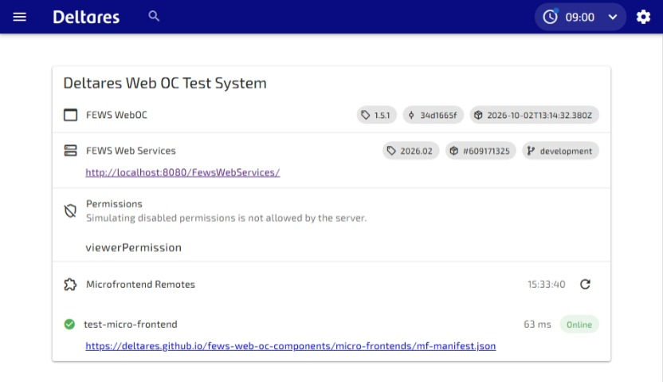
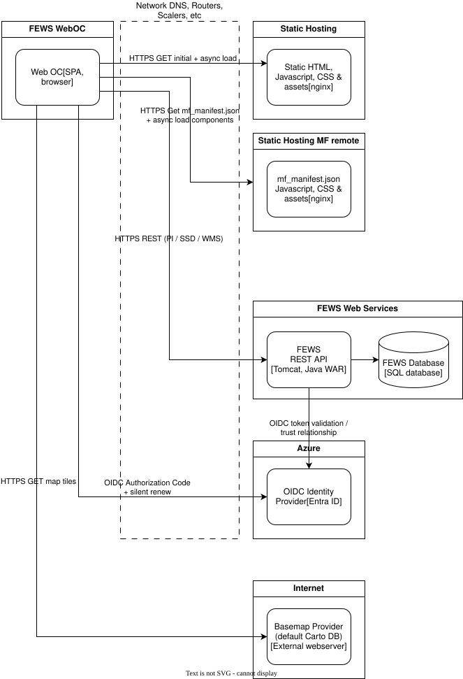

# Deploying Micro Frontends

Web OC uses [Module Federation](https://module-federation.io/) to load independently deployed micro frontend components at runtime.

See [FEWS WebOC micro frontend demos](https://deltares.github.io/fews-web-oc-components/micro-frontends/) for examples.

## Deploy the Micro Frontend

Module Federation supports many build tools and frameworks. See [Integrations - Module Federation](https://module-federation.io/integrations/index.html) to choose the integration for your micro frontend project.

The build instructions in this document assume the micro frontend project uses Vite. For other build tools, follow the corresponding Module Federation integration documentation.

1. Build the micro frontend using its project's build command. See Vite's [Building for Production](https://vite.dev/guide/build.html) documentation. To configure Module Federation and generate the `mf-manifest.json` file, see [Vite - Module Federation](https://module-federation.io/integrations/build-tool/vite.html). Configure its public asset URL to match the deployment location so the remote entry and its JavaScript and CSS assets resolve correctly; see Vite's [Public Base Path](https://vite.dev/guide/build.html#public-base-path) documentation.
2. Publish the complete build output, including the generated Module Federation `mf-manifest.json`, remote entry, and assets, to a web server or static hosting service.
3. Verify that the manifest and all referenced assets are accessible from the browsers that access Web OC. Serve JSON with `application/json` and JavaScript with a valid JavaScript content type. Do not return a login page or an HTML fallback for these files.

## Web server configuration

The micro frontend can be hosted on the same domain as Web OC, for example `https://weboc.example.org/micro-frontends/`, or on another domain, for example `https://components.example.org/`.

For a different origin (including a different subdomain or port), configure the micro frontend server's [CORS](https://developer.mozilla.org/en-US/docs/Web/HTTP/Guides/CORS) headers to allow the Web OC origin to fetch its manifest and load its modules. For example, a Web OC hosted at `https://weboc.example.org` needs `Access-Control-Allow-Origin: https://weboc.example.org` on the remote responses. Public, unauthenticated assets can also use `Access-Control-Allow-Origin: *`.

Use HTTPS when Web OC is served over HTTPS. For micro frontend hosting, it is recommended to configure strict [Content Security Policy (CSP)](https://developer.mozilla.org/en-US/docs/Web/HTTP/Guides/CSP) response headers, allowing only the sources needed by any pages served from that host. Use [MDN Observatory](https://developer.mozilla.org/en-US/observatory) to check the hosting site's HTTP security headers. CSP headers on remote assets do not replace Web OC's document policy or restrict remote code running within Web OC.

> [!WARNING]
> Only configure trusted remotes: their code runs within the Web OC application.

## Configure Web OC

If Web OC uses a [Content Security Policy (CSP)](https://developer.mozilla.org/en-US/docs/Web/HTTP/Guides/CSP), allow the remote origin in the applicable directives, including `connect-src` for manifest requests and `script-src` for scripts. Allow any additional asset origins as needed.

Web OC reads `app-config.json` from its deployment base path at startup, for example `https://weboc.example.org/weboc/app-config.json`. For a source build, the file is `public/app-config.json` and is copied to the build output.

The `VITE_FEWS_WEBOC_MF_MANIFEST_URL` setting points to a **Web OC remote registry manifest** containing a `remotes` array. This is distinct from the generated Module Federation manifest of an individual micro frontend.

1. Publish a registry manifest, for example `https://weboc.example.org/weboc/micro-frontends.json`:

   ```json
   {
     "name": "delft-fews-weboc",
     "remotes": [
       {
         "name": "my-micro-frontend",
         "entry": "https://components.example.org/mf-manifest.json"
       }
     ]
   }
   ```

   Each `entry` points to the deployed micro frontend's generated Module Federation manifest. Add an entry for each remote. The remote `name` must match the `remoteId` used in the Delft-FEWS micro frontend configuration. If the registry itself is hosted on another origin, it also needs CORS headers.

2. Merge the following setting into the existing Web OC `app-config.json`, preserving its other settings:

   ```json
   {
     "VITE_FEWS_WEBOC_MF_MANIFEST_URL": "https://weboc.example.org/weboc/micro-frontends.json"
   }
   ```

3. Configure the micro frontend definitions in Delft-FEWS, with a `remoteId` matching the registry name and a `componentId` matching an exposed component. Reference the micro frontend's configured `id` in the appropriate topology node. Web OC retrieves these definitions through FEWS WebServices; the registry alone does not create a display.
4. Reload Web OC to load the updated configuration. Runtime configuration changes do not require rebuilding Web OC. Without a manifest URL, micro frontends are disabled.

## Test with the Demo Micro Frontends

The [demo app](https://deltares.github.io/fews-web-oc-components/micro-frontends/) is publicly hosted on GitHub Pages. It provides a [main panel](https://deltares.github.io/fews-web-oc-components/micro-frontends/main) showing Palmiet locations on an interactive globe and a [critical points overview](https://deltares.github.io/fews-web-oc-components/micro-frontends/critical-points) showing forecast water levels ranked by threshold exceedance. These standalone views use sample data: opening them verifies access to the demo site, not connectivity to your FEWS Web Services or integration with Web OC.

The demo micro frontends are available through the [demo Module Federation manifest](https://deltares.github.io/fews-web-oc-components/micro-frontends/mf-manifest.json).

To connect to them, publish this Web OC registry manifest, for example as `https://weboc.example.org/weboc/micro-frontends.json`:

```json
{
  "name": "delft-fews-weboc",
  "remotes": [
    {
      "name": "test-micro-frontend",
      "entry": "https://deltares.github.io/fews-web-oc-components/micro-frontends/mf-manifest.json"
    }
  ]
}
```

Set `VITE_FEWS_WEBOC_MF_MANIFEST_URL` in `app-config.json` to the URL of this registry, as shown above. Do not set it directly to the demo manifest URL: that file describes one remote, not the Web OC `remotes` array.

Use `test-micro-frontend` as the `remoteId` in the Delft-FEWS configuration, and choose a `componentId` from the demo manifest's `exposes` list.

> [!INFO]
> The demo is intended for testing; deploy and manage your own remote for production.

### Demo Deployment Considerations

- **Network access:** Users' browsers need outbound HTTPS access to `https://deltares.github.io`, including the manifest, `remoteEntry.js`, and assets under `/fews-web-oc-components/micro-frontends/`. Access from the Web OC server alone is not sufficient; check corporate proxies and browser network restrictions.
- **Browser security:** Allow `https://deltares.github.io` in Web OC's applicable CSP directives, including `connect-src` and `script-src`. Check CORS responses from the remote host and allow any additional origins needed by the selected component's assets or data requests.
- **Integration checks:** Use the registry example above and the matching Delft-FEWS definitions. Test the actual topology display with your FEWS Web Services and authentication settings; the standalone sample-data demo does not validate these settings.
- **Compatibility:** Review the remote manifest's `shared` dependencies and required versions against the Web OC build. The demo shares Vue as a singleton, so dependency compatibility matters when updating either application.
- **Self-hosting:** The published demo manifest has a `publicPath` pointing to GitHub Pages. Copying only that manifest does not relocate its assets. Build and publish the complete remote with its public asset URL set to your hosting location.
- **Release control:** The public demo URL is not a version-pinned release and may change independently of your Web OC deployment. For managed environments, use versioned remote deployments, retain the previous release for rollback, and update the registry only after validating the new manifest and assets. Revalidate manifests and registry files rather than caching them indefinitely; use long-lived caching only for content-hashed assets.

## Verify the Connection

- Check the Microfrontend Remotes section of Web OC's About view for the registered remotes, for example at [https://weboc.example.org/weboc/about](https://weboc.example.org/weboc/about). Replace the domain and deployment base path with those of your Web OC installation.



- Open the configured micro frontend topology display and verify that its component renders.
- In the browser's Network tab, check that the registry, remote manifest, remote entry, and assets load successfully. Investigate CORS, Content Security Policy, incorrect asset URLs, or HTML responses if loading fails.
- If the remote is registered but the display fails, check the Delft-FEWS micro frontend `id`, `remoteId`, and exposed `componentId`.

## WebOC with micro frontend infrastructure

The diagram below shows an example infrastructure using [Nginx](https://nginx.org/) for static hosting. One Nginx server serves Web OC's HTML, JavaScript, CSS, and assets; a separate Nginx host serves the micro frontend's Module Federation manifest and component assets. The micro frontend host can use the same domain as Web OC or a different domain, as described above.

Web OC runs in the user's browser, which loads the micro frontend manifest and components over HTTPS at runtime. The browser also communicates with FEWS Web Services, deployed as a Java WAR in Tomcat, for PI, SSD, and WMS requests. FEWS Web Services connects to the FEWS database; the browser does not access the database directly. In this example, Azure Entra ID provides OpenID Connect authentication, and CARTO provides basemap tiles.

For Web OC hosting instructions and CSP recommendations, see [Web OC Deployments](../deployments/README.md), including the [Nginx configuration](../deployments/README.md#nginx). Keep the Web OC navigation fallback separate from the remote asset routes: requests for remote manifests and assets must return the actual files, not Web OC's `index.html`.

