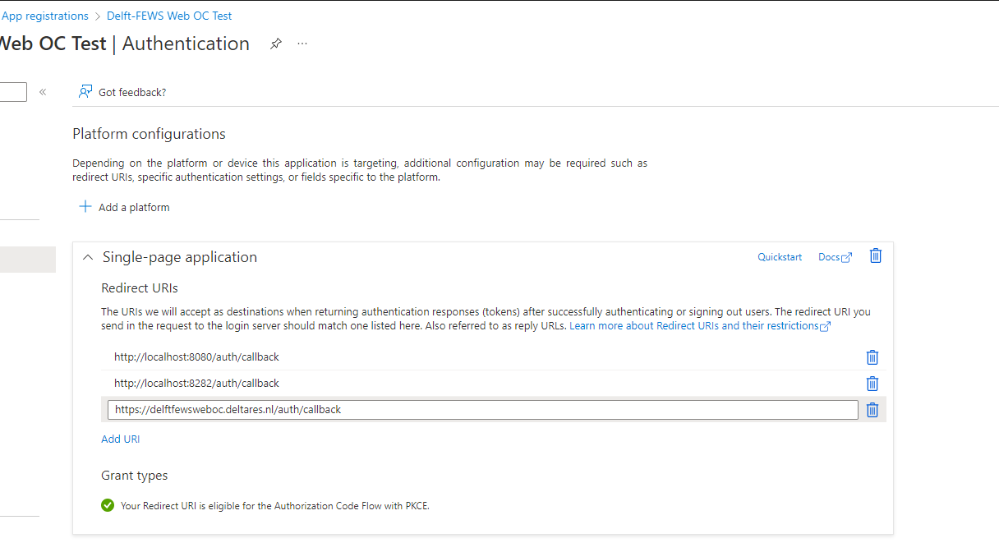
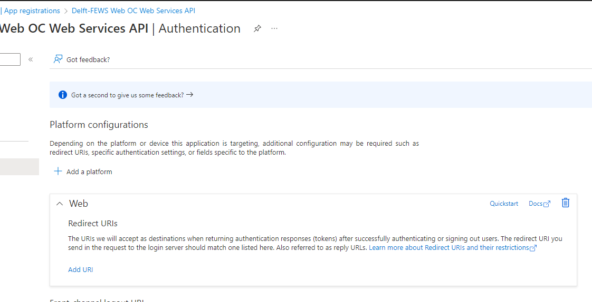
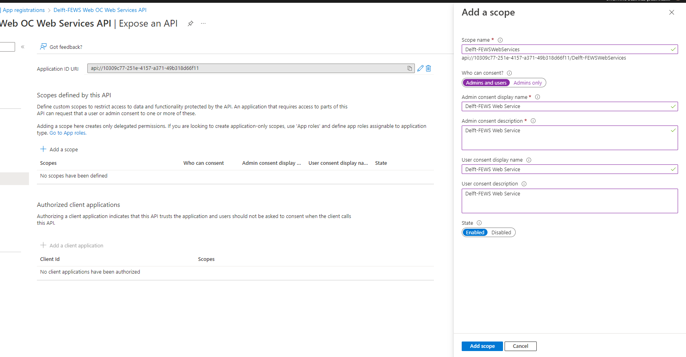
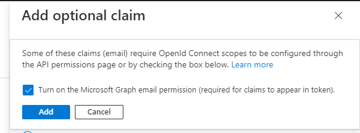
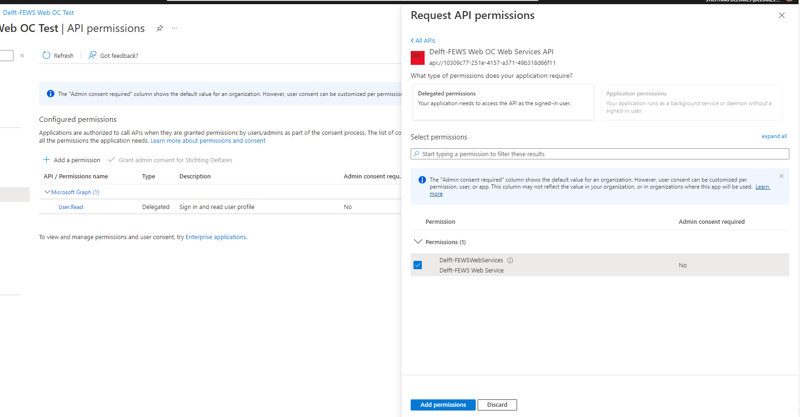

# Delft-FEWS Web OC Open ID Connect

The Delft-FEWS Web OC is distributed as a single page web application.
It is possible to enable OIDC as authentication solution and pass access tokens to the Delft-FEWS Web Service API to apply role based access.

## Azure AD

The following example explains how the Delft-FEWS Web OC and Delft-FEWS WebServices can be configured to support OIDC.

In Azure AD 2 app registrations have to be created.

App Registration for the Delft-FEWS Web OC. For example: Delft-FEWS Web OC Test

App Registration for the Delft-FEWS Web Services. For example: Delft-FEWS Web OC Web Services API


Now the Delft-FEWS Web OC Web Services API app registration needs to expose permissions.
From the Azure Portal, select the Delft-FEWS Web OC Web Services API app registration.
Select the Expose an API permissions menu.
Select Add a scope
Enter a name for the scope. For example: Delft-FEWSWebServices
A scope URL will be generated, similar to: api://10309c77-251e-4157-a371-49b318d66f11/Delft-FEWSWebServices


The optional email claim has to be added to the access token.
From the Token configuration menu, select Add optional claim.
When saving the optional claim, the Azure Portal will request to turn on the Microsoft Graph email permission. Allow this.


Now the Delft-FEWS Web OC Test app registration needs API permissions on the Delft-FEWS Web OC Web Services API.
From the Azure Portal, select the Delft-FEWS Web OC Test app registration.
Select the API permissions menu.
Select "My APIs"
Choose the Delft-FEWS Web OC Web Services API.


In the app-config.json file of the Delft-FEWS Web OC, the following OIDC properties have to be set:

```json
{
  "VITE_AUTH_AUTHORITY": "https://login.microsoftonline.com/MYTENANTID/",
  "VITE_AUTH_METADATA_URL": "https://login.microsoftonline.com/MYTENANTID/v2.0/.well-known/openid-configuration"
  "VITE_AUTH_ID": "MY-CLIENT_ID",
  "VITE_AUTH_SCOPE": "openid email <scopeURL>",
  "VITE_REQUEST_HEADER_AUTHORIZATION": "Bearer"
}

```

VITE_AUTH_ID has to be the Application (client) id of the Delft-FEWS Web OC Test app registration.
For the VITE_AUTH_SCOPE, the value should be: "openid profile email Offline_Access api://myclientid/Delft-FEWSWebServices"
