## Keycloak

The following example explains how the Delft-FEWS Web OC and Delft-FEWS WebServices can be configured to support OIDC.
The keycloak docker image will be used to show how to configure.
Se also the [Keycloak documentation](https://www.keycloak.org/getting-started/getting-started-docker) for more information.

In this example we assume that the Delft-FEWS Web OC and Delft-FEWS WebServices are running on the same server:
http://localhost:8080 for the Web OC and http://localhost:8080/FewsWebServices/ for the Delft-FEWS Web Services.

Keycloak will be running on http://localhost:8888.

```commandline
docker run -p 8888:8080 -d -e KC_BOOTSTRAP_ADMIN_USERNAME=admin -e KC_BOOTSTRAP_ADMIN_PASSWORD=admin quay.io/keycloak/keycloak:26.0.1 start-dev
```

After starting the Keycloak docker image, the Keycloak admin console can be accessed at http://localhost:8888/auth/admin.

Create a new realm, for example: weboc.

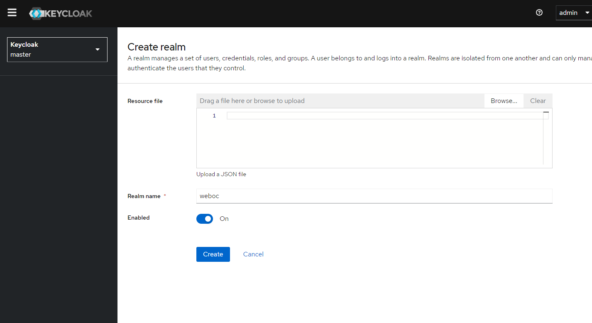

Create a new client, for example: weboc-client-id.

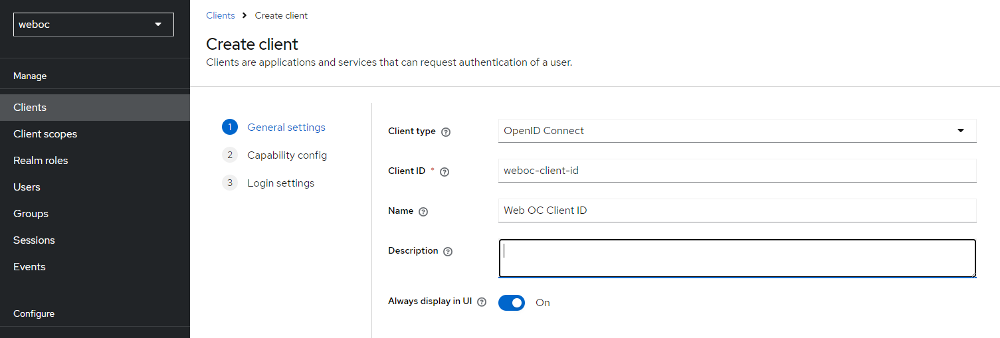

Select the default client capabilities:

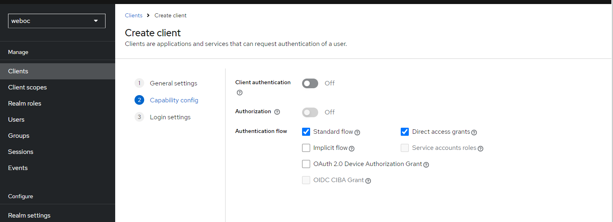

For the login settings, the following need to be set:

- Root URL (homepage of the web oc): http://localhost:8080
- Home URL (homepage of the web oc): http://localhost:8080
- Valid Redirect URIs: http://localhost:8080/auth/callback
- Valid Post Logout Redirect URIs: http://localhost:8080
- Web origins: +

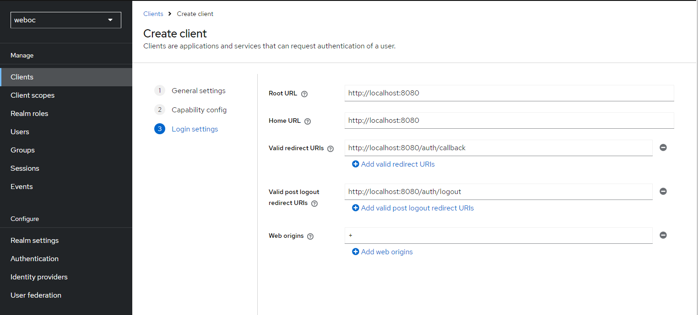


Create a new user, for example: weboc.

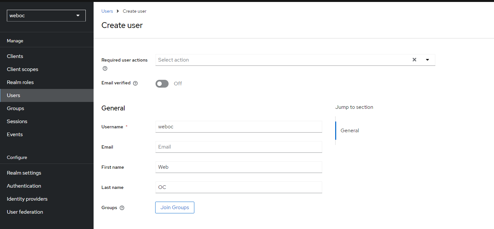

Set the password for the user weboc.

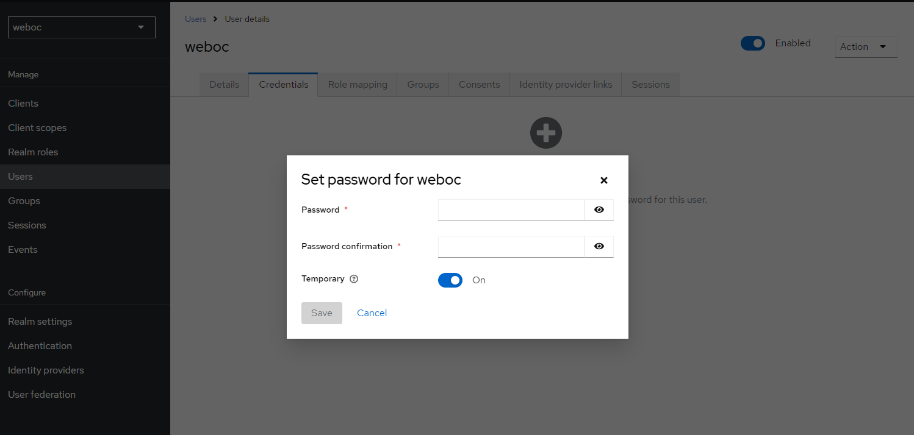

If keycloak has been set up as described, it is now possible to login to the Delft-FEWS Web OC with the user weboc.
The only thing that is missing is the configuration of the app-config.json file of the Delft-FEWS Web OC.

In the app-config.json file of the Delft-FEWS Web OC, the following OIDC properties have to be set:

```json
{
  "VITE_FEWS_WEBSERVICES_URL": "http://localhost:8080/FewsWebServices/",
  "VITE_AUTH_AUTHORITY": "http://localhost:8888/auth/realms/weboc",
  "VITE_AUTH_METADATA_URL": "http://localhost:8888/realms/weboc/.well-known/openid-configuration",
  "VITE_AUTH_ID": "weboc-client-id",
  "VITE_AUTH_SCOPE": "openid profile email offline_access",
  "VITE_REQUEST_HEADER_AUTHORIZATION": "Bearer"
}
```

If you now open the Delft-FEWS Web OC in the browser, a login screen will appear.

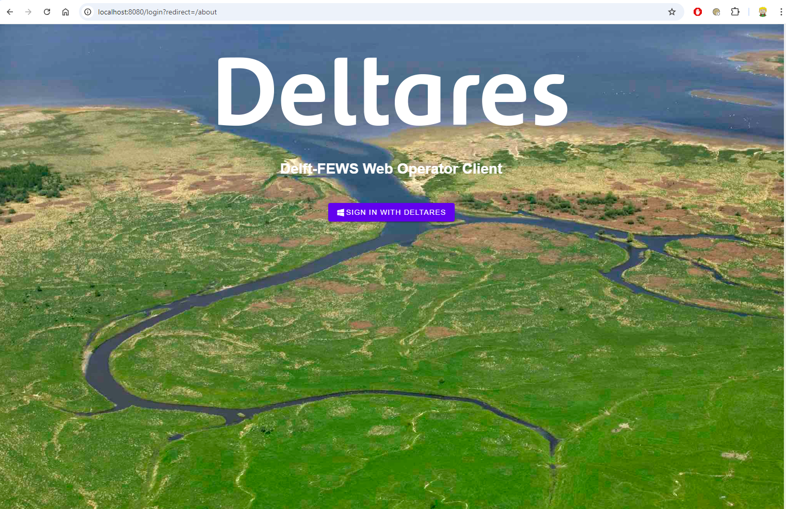

After clicking the login button, you will be redirected to the Keycloak login page.


After logging in, you will be redirected back to the Delft-FEWS Web OC.
On the top left you can see you are logged in.

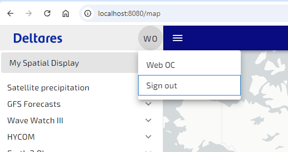

Here it is also possible to logout.

# Groups

For integration with the WebServices UserGroups and Permissions, group memberships have to be passed in an access token to the Delft-FEWS WebServices.

In keycloak groups can be configured in the Groups section:

- WS_VIEWER: For Web OC users that can only view data.
- WS_EDITOR: For Web OC users that can edit data or perform other actions like running workflows.

This can be done by adding the following mapper to the client in Keycloak:

In the weboc-client-id client, select Client Scopes and selected the weboc-client-id-dedicated client scope.

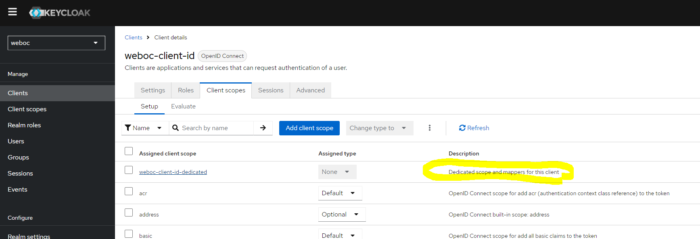

Here a mapper can be configured.
Chose: Configure a new mapper and select Group Membership.

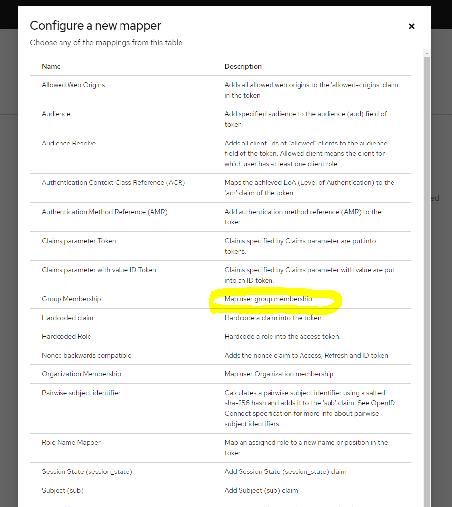


Create a claim called groups and make sure it is added to the access token and id token.
Disable Full group path is selected.

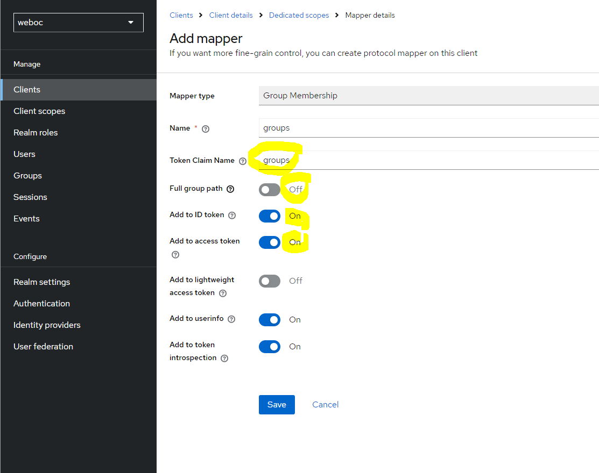

This will make sure that the groups are passed in the access token.
In a decoded acccess token the groups will be available:

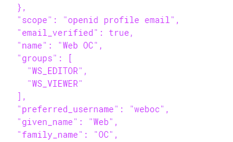


# Web Services OIDC Configuration

For the Delft-FEWS WebServices to accept the access token, please refer to the following documentation:

https://publicwiki.deltares.nl/display/FEWSDOC/FEWS+Web+Services+Security+with+Open+ID+Connect

For this example, the following configuration environment variables are required:

- FEWS_WS_AUTHENTICATION_TYPE: AuthenticationOpenIdConnect
- FEWS_WS_AUTHENTICATION_OAUTH2_KEYS_URI: http://localhost:8888/realms/weboc/protocol/openid-connect/certs
- FEWS_WS_AUTHENTICATION_EDITOR_GROUPS: WS_EDITOR 
- FEWS_WS_AUTHENTICATION_VIEWER_GROUPS: WS_VIEWER

Take note that the weboc in the URL is the name of the realm that was created in Keycloak.

