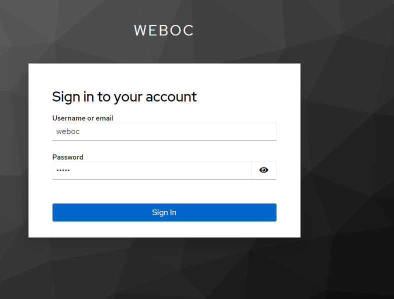

## Keycloak

The following example explains how the Delft-FEWS Web OC and Delft-FEWS WebServices can be configured to support OIDC.
The keycloak docker image will be used.
See also the [Keycloak documentation](https://www.keycloak.org/getting-started/getting-started-docker) for more information.

In this example we assume that the Delft-FEWS Web OC and Delft-FEWS WebServices are running on the same server:
http://localhost:8080 for the Web OC and http://localhost:8080/FewsWebServices/ for the Delft-FEWS Web Services.

Keycloak will be running on http://localhost:8888.

```commandline
docker run -p 8888:8080 -d -e KC_BOOTSTRAP_ADMIN_USERNAME=admin -e KC_BOOTSTRAP_ADMIN_PASSWORD=admin quay.io/keycloak/keycloak:26.0.1 start-dev
```

After starting the Keycloak docker image, the Keycloak admin console can be accessed at http://localhost:8888/auth/admin.

Create a new realm, for example: weboc.


Create a new client, for example: weboc-client-id.


Select the default client capabilities:


For the login settings, the following need to be set:

- Root URL (homepage of the web oc): http://localhost:8080
- Home URL (homepage of the web oc): http://localhost:8080
- Valid Redirect URIs: http://localhost:8080/auth/callback
- Valid Post Logout Redirect URIs: http://localhost:8080/auth/logout
- Web origins: +


Create a new user, for example: weboc.


Set the password for the user weboc.


If keycloak has been set up as described, it is now possible to login to the Delft-FEWS Web OC with the user weboc.
The only thing that is required is to update the Web OC configuration file: app-config.json.

In the app-config.json file of the Delft-FEWS Web OC, the following OIDC properties have to be set:

```json
{
  "VITE_FEWS_WEBSERVICES_URL": "http://localhost:8080/FewsWebServices/",
  "VITE_AUTH_AUTHORITY": "http://localhost:8888/auth/realms/weboc",
  "VITE_AUTH_METADATA_URL": "http://localhost:8888/realms/weboc/.well-known/openid-configuration",
  "VITE_AUTH_ID": "weboc-client-id",
  "VITE_AUTH_SCOPE": "openid profile email",
  "VITE_REQUEST_HEADER_AUTHORIZATION": "Bearer"
}
```

If you now open the Delft-FEWS Web OC in the browser (http://localhost:8080), a login screen will appear.


After clicking the login button, you will be redirected to the Keycloak login page.



After logging in, you will be redirected back to the Delft-FEWS Web OC.
On the top left you can see you are logged in. Here it is also possible to logout.


# Groups or Roles

In Keycloak, groups or roles can be created to manage permissions. Both are supported by Delft-FEWS, but roles are recommended since they decouple groups from application roles.

## Roles

For integration with the WebServices UserGroups and Permissions, group memberships have to be passed in an access token to the Delft-FEWS WebServices.

In keycloak roles can be configured in the Realm Roles section:

- WS_VIEWER: For Web OC users that can only view data.
- WS_EDITOR: For Web OC users that can edit data or perform other actions like running workflows.


Roles can now either be assigned to a user or a group. In this example, we will assign the roles to a user directly. In general, it is recommended to assign roles to groups and assign users to groups.


The next step is to configure the client to pass the roles in the access token.

In the weboc-client-id client, select Client Scopes and selected the weboc-client-id-dedicated client scope.
Here a mapper can be configured.
Chose: Configure a new mapper and select User Realm Role.


Make sure to create a claim called roles and make sure it is added to the access token and id token.
(If is also possible to add a group mapper. Only one of the two should be configured. If both are configured, the roles claim will be used and the groups claim will be ignored.)


## Groups

For integration with the WebServices UserGroups and Permissions, group memberships have to be passed in an access token to the Delft-FEWS WebServices.

In keycloak groups can be configured in the Groups section:

- WS_VIEWER: For Web OC users that can only view data.
- WS_EDITOR: For Web OC users that can edit data or perform other actions like running workflows.

This can be done by adding the following mapper to the client in Keycloak:

In the weboc-client-id client, select Client Scopes and selected the weboc-client-id-dedicated client scope.


Here a mapper can be configured.
Chose: Configure a new mapper and select Group Membership. N.B.: It is recommended to use Roles instead of Groups.


Create a claim called groups and make sure it is added to the access token and id token.
Disable Full group path. It should be Off.


This will make sure that the groups are passed in the access token.
The access token will contain the groups claim with all groups a user is member off.


# Web Services OIDC Configuration

For the Delft-FEWS WebServices to accept the access token, please refer to the following documentation:
https://publicwiki.deltares.nl/display/FEWSDOC/FEWS+Web+Services+Security+with+Open+ID+Connect

N.B.: OIDC integration is NOT supported when using embedded tomcat. The Delft-FEWS WebServices should be deployed on a separate tomcat server.

For this example, the following configuration environment variables are required:

- FEWS_WS_AUTHENTICATION_TYPE: AuthenticationOpenIdConnect
- FEWS_WS_AUTHENTICATION_OAUTH2_KEYS_URI: http://localhost:8888/realms/weboc/protocol/openid-connect/certs
- FEWS_WS_AUTHENTICATION_EDITOR_GROUPS: WS_EDITOR 
- FEWS_WS_AUTHENTICATION_VIEWER_GROUPS: WS_VIEWER

# Delft Fews Configuration

To use permissions, they need to be enabled in the PiServiceConfigFiles/WebServices.xml configuration of Delft-FEWS
For example:

```xml
<?xml version="1.0" encoding="utf-8"?>
<webServices xmlns="http://www.wldelft.nl/fews" xmlns:xsi="http://www.w3.org/2001/XMLSchema-instance"
			 xsi:schemaLocation="http://www.wldelft.nl/fews https://fewsdocs.deltares.nl/schemas/version1.0/webServices.xsd">
	<general>
        <readonlyMode>false</readonlyMode>
		<permissions>
			<enablePermissions>true</enablePermissions>
		</permissions>
	</general>
</webServices>
```

Suppose we want to have a WebOC permission that applies to the WebOC user group. In the SystemConfigFiles/UserGroups.xml the following configuration can be added, where the systemUserGroup should match the group name in Keycloak.
In this example we assume there is a keycloak group called: WEBOC_USER

```xml
<?xml version="1.0" encoding="UTF-8"?>
<userGroups xmlns="http://www.wldelft.nl/fews" xmlns:xsi="http://www.w3.org/2001/XMLSchema-instance" xsi:schemaLocation="http://www.wldelft.nl/fews https://fewsdocs.deltares.nl/schemas/version1.0/userGroups.xsd">
    <userGroup id="WebOC">
        <systemUserGroup id="WEBOC_USER"></systemUserGroup>
    </userGroup>
</userGroups>
```

In the SystemConfigFiles/Permissions.xml the following configuration can be added, where the WebOC permission is defined.

```xml
<?xml version="1.0" encoding="UTF-8"?>
<permissions xmlns="http://www.wldelft.nl/fews" xmlns:xsi="http://www.w3.org/2001/XMLSchema-instance" xsi:schemaLocation="http://www.wldelft.nl/fews https://fewsdocs.deltares.nl/schemas/version1.0/permissions.xsd">
	<permission id="WebOC">
		<userGroup id="WebOC"></userGroup>
	</permission>
</permissions>

```

Finally, the permissions can be applied to the relevant parts in the Delft-FEWS configuration. For example in the Topolgy.xml file certain nodes can be made available using the webOC permission.
If no permissions are applied to a node, they will be available to the Web OC as well.

```xml
<?xml version="1.0" encoding="UTF-8"?>
<topology xmlns="http://www.wldelft.nl/fews" xmlns:xsi="http://www.w3.org/2001/XMLSchema-instance" xsi:schemaLocation="http://www.wldelft.nl/fews https://fewsdocs.deltares.nl/schemas/version1.0/topology.xsd">
	<nodes id="Information_Sources" name="Information Sources">
        .....    
		<nodes id="Delft-FEWS">
			<viewPermission>WebOC</viewPermission>
		</nodes>
        ......
</topology>
``` 

If setup correctly only the topoloyg nodes that a Web OC user has permissions for are displayed to the logged in user.